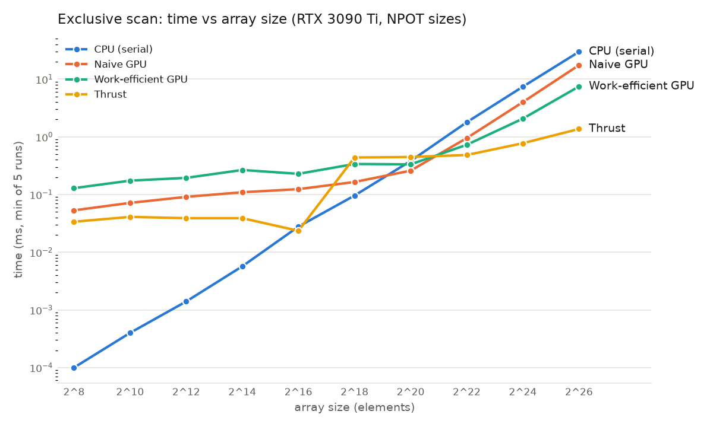
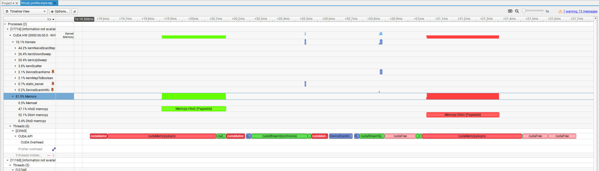
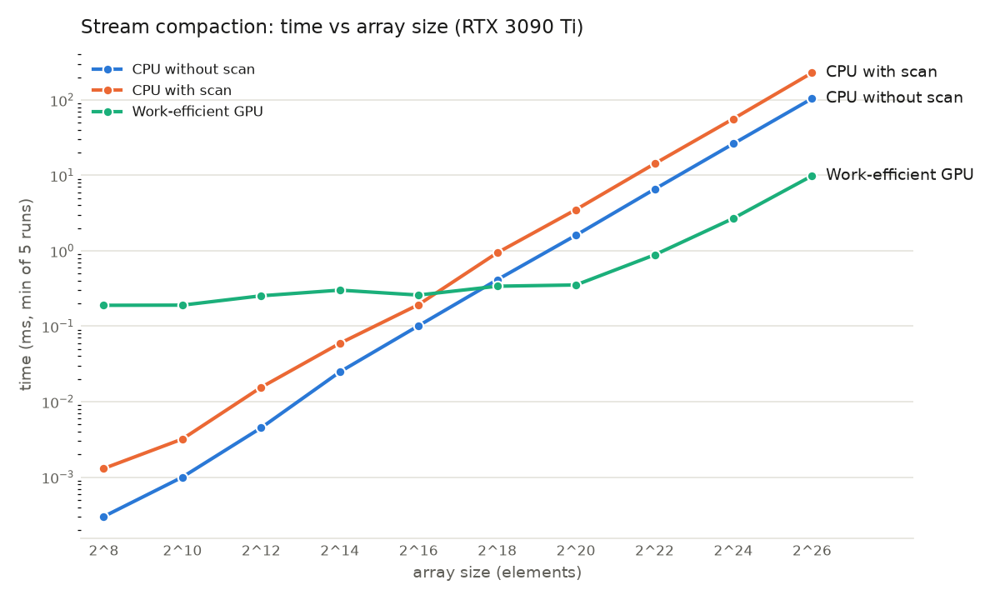

CUDA Stream Compaction
======================

**University of Pennsylvania, CIS 5650: GPU Programming and Architecture, Project 2**

* Anna (Nanru) Dai
  * [LinkedIn](https://www.linkedin.com/in/nanru-dai-8b33a9261/)
* Tested on: Windows 11 Home, AMD Ryzen 9 5950X 16-Core @ 3.4GHz, 128GB RAM, NVIDIA GeForce RTX 3090 Ti 24GB (personal machine)
* CUDA 13.3, CMake 4.4.3, Visual Studio 2022. All timings from Release builds run without the debugger.

## Overview

Scan (exclusive prefix sum) and stream compaction (removing zeros from an int
array) implemented on the GPU in CUDA, compared against a serial CPU version and
Thrust. The code is in `stream_compaction/` so it can be reused in the path tracer.

Implemented:

* `cpu.cu`: serial scan, compaction with a write pointer, and compaction using
  map / scan / scatter.
* `naive.cu`: naive parallel scan in global memory, `log2(n)` kernel launches,
  two ping-pong buffers. The input is shifted right by one before the scan so
  the inclusive algorithm gives an exclusive result directly.
* `efficient.cu`: work-efficient up-sweep / down-sweep scan, in place, padded
  to a power of two. Also stream compaction built on top of it, with the map and
  scatter kernels in `common.cu`.
* `thrust.cu`: `thrust::exclusive_scan` on device vectors.

All versions work for non-power-of-two sizes and were checked up to 2^26 elements.

Compaction is three parallel passes:

```
input   [1 5 0 1 2 0 3]
map     [1 1 0 1 1 0 1]     bools[i] = input[i] != 0
scan    [0 1 2 2 3 4 4]     indices  = exclusive_scan(bools)
scatter [1 5 1 2 3]         if bools[i]: out[indices[i]] = input[i]
count = indices[n-1] + bools[n-1] = 5
```

`indices[i]` is the number of kept elements before position i, which is the
write position the serial loop would have tracked with a counter. Computing it
with a scan means each thread knows its own destination and no two kept
elements collide.

## Build

```powershell
cmake -S . -B build
cmake --build build --config Release
.\build\bin\Release\cis5650_stream_compaction_test.exe
```

One line was added to `stream_compaction/CMakeLists.txt`:

```cmake
target_compile_options(stream_compaction PRIVATE "$<$<COMPILE_LANGUAGE:CUDA>:-Xcompiler=/Zc:preprocessor>")
```

The Thrust headers in CUDA 13 fail to compile under MSVC's default preprocessor
(`error C1189`), and this passes `/Zc:preprocessor` through to `cl.exe`.
Nothing else in the CMake files was changed.

## Performance

### Method

GPU times use CUDA events, CPU times use `std::chrono`, and the timed region
excludes the initial and final `cudaMalloc` / `cudaMemcpy`. Single runs varied
by up to 2x, and the first call of each kernel is slower because of CUDA's lazy
module loading, so every number here is the minimum of 5 runs.

`sweep.sh` in the repo root does the sweeps: it edits `SIZE` in `src/main.cpp`
and the `blockSize` constants, rebuilds, runs the test program `REPEAT` times,
and writes the minimum for each test to a CSV. It restores the source files when
it finishes.

```powershell
# block size sweep at SIZE = 2^22
bash -c "REPEAT=5 bash sweep.sh block 64 128 256 512 1024 > block_sweep.csv"

# array size sweep with the chosen block sizes
bash -c "REPEAT=5 bash sweep.sh size 8 10 12 14 16 18 20 22 24 26 > size_sweep.csv"
```

(`bash -c` because `VAR=value cmd` does not work in PowerShell.) Raw data is in
[`block_sweep.csv`](block_sweep.csv) and [`size_sweep.csv`](size_sweep.csv).
Plots use the non-power-of-two rows, since the power-of-two test is the first
call of each implementation and includes module-load time.

### Block size

n = 2^22 - 3, times in ms:

| blockSize | naive scan | work-efficient scan | work-efficient compact |
|---|---|---|---|
| 64   | 1.065 | 0.775 | 0.962 |
| 128  | 0.957 | 0.733 | 0.842 |
| 256  | 0.959 | 0.769 | 0.901 |
| 512  | 0.949 | 0.718 | 0.872 |
| 1024 | 1.041 | 0.716 | 0.867 |

Anything from 128 to 1024 is very close in performance; only 64 is clearly
worse. These kernels do one or two memory accesses and one add per thread, so
they are limited by memory traffic rather than by how threads are grouped. I
went with 256 for naive and 512 for work-efficient.

### Scan



| n | CPU | naive | work-efficient | thrust |
|---|---|---|---|---|
| 2^8  | 0.0001 | 0.053 | 0.129 | 0.034 |
| 2^10 | 0.0004 | 0.072 | 0.174 | 0.041 |
| 2^12 | 0.0014 | 0.091 | 0.195 | 0.039 |
| 2^14 | 0.0057 | 0.110 | 0.267 | 0.039 |
| 2^16 | 0.028  | 0.124 | 0.229 | 0.024 |
| 2^18 | 0.096  | 0.165 | 0.339 | 0.439 |
| 2^20 | 0.381  | 0.259 | 0.333 | 0.448 |
| 2^22 | 1.791  | 0.951 | 0.728 | 0.484 |
| 2^24 | 7.402  | 4.001 | 2.068 | 0.775 |
| 2^26 | 29.79  | 17.47 | 7.469 | 1.369 |

(ms, non-power-of-two sizes)

#### Small arrays

Below 2^16 the GPU lines are flat: the time is launch overhead, not work.
Naive launches `log2(n)` kernels and work-efficient launches twice that plus a
`cudaMemset`, so work-efficient is about 2x slower here. The CPU is faster than
naive and work-efficient until 2^18; they pass it at 2^20, and Thrust passes it
at 2^22.

#### Naive

At 2^26 each array is 268 MB. Naive does 26 passes that each read and write the
whole array, about 14 GB total, in 17.5 ms. That is roughly 800 GB/s, close to
the 3090 Ti's peak of about 1 TB/s. Each pass is well behaved (adjacent threads
read adjacent addresses), so naive is simply bandwidth bound and pays for its
O(n log n) traffic.

#### Work-efficient

2.3x faster than naive at 2^26. It does O(n) adds, so on paper it should be
closer to 13x faster. Two things get in the way. At level d the active threads
touch addresses `stride` apart, and once `stride` is past 8 ints every access
lands in its own 32-byte sector, so the accesses are not coalesced. And at the
top of the tree there are very few threads (down to one), so there is nothing
to hide memory latency, on top of twice as many launches. It does scale better
than the others: going from 2^24 to 2^26, CPU time grows 4.0x, naive 4.4x,
work-efficient 3.6x.

#### Thrust

Another 5.5x faster than work-efficient at 2^26. Thrust's scan is CUB's
single-pass decoupled look-back: input read once, output written once, block
scans in shared memory. It moves about 537 MB in 1.37 ms (390 GB/s) and grows
only 1.8x from 2^24 to 2^26, so it is not saturating memory yet.

Between 2^16 and 2^18 it jumps from 0.024 ms to 0.44 ms and then keeps a
0.4 ms floor. An Nsight Systems trace shows what happens inside each
`thrust::exclusive_scan` call, all of it inside our timed region:

```
cudaMalloc                        temporary storage for CUB
cudaLaunchKernel  DeviceScanInitKernel
cudaLaunchKernel  DeviceScanKernel
cudaStreamSynchronize
cudaFree
```



One `thrust::exclusive_scan` call at n = 2^20. The two CUB kernels are the small
marks in the `DeviceScanKernel` rows; the `cudaMalloc`, `cudaStreamSynchronize`
and `cudaFree` around them are what fill the timed region. The `cudaMemcpyAsync`
blocks on either side are the `device_vector` copies, outside the timer.

The two kernels take about 11 us of GPU time at 2^20. The same sequence runs
at 2^16 and 2^20; what changes is the cost of the calls around the kernels.
At 2^16 the `cudaMalloc` and `cudaFree` take about 5 us each. At 2^20 they take
about 75 us and 130 us, and the synchronize about 100 us, so the call is
dominated by allocation and synchronization rather than by the scan itself.
That is the flat part of the Thrust line from 2^18 to 2^22. I did not dig into
why the allocation gets so much more expensive; my guess is that the larger
buffers freed and reallocated in the same call make the driver map memory
instead of reusing a cached block. Outside the timed region, the trace also
shows the `device_vector` copies as `cudaMemcpyAsync` and a fill kernel from
constructing `dv_out(n)`.

Trace commands (with `SIZE` set to `1 << 20` and `1 << 16`):

```powershell
& "C:\Program Files\NVIDIA Corporation\Nsight Systems 2026.1.3\target-windows-x64\nsys.exe" profile --trace=cuda -o build\thrust_profile .\build\bin\Release\cis5650_stream_compaction_test.exe
& "C:\Program Files\NVIDIA Corporation\Nsight Systems 2026.1.3\target-windows-x64\nsys.exe" stats --report cuda_api_trace,cuda_gpu_kern_sum build\thrust_profile.nsys-rep
```

### Stream compaction



| n | CPU without scan | CPU with scan | work-efficient GPU |
|---|---|---|---|
| 2^8  | 0.0003 | 0.0013 | 0.189 |
| 2^16 | 0.102  | 0.193  | 0.259 |
| 2^20 | 1.608  | 3.515  | 0.353 |
| 2^22 | 6.569  | 14.28  | 0.883 |
| 2^24 | 26.26  | 56.27  | 2.692 |
| 2^26 | 104.2  | 229.0  | 9.870 |

(ms)

GPU compaction is the work-efficient scan plus about 2.4 ms at 2^26 for the
extra passes: map, a device-to-device copy of the bool array (the scan is in
place and scatter still needs the original bools), and scatter. It passes the
CPU at 2^18 and is 10.6x faster than the best CPU version at 2^26.

CPU compaction is much slower than CPU scan on the same input (104 ms vs
30 ms) because of the data-dependent `if (idata[i] != 0)`; a quarter of the
inputs are zero, so the branch predictor misses a lot. The CPU version with
scan is another 2.2x slower on top of that from three passes and two heap
allocations. On the CPU the scan formulation is just extra work; it only pays
off when the three passes run in parallel.

### Bottlenecks

| Implementation | Limited by |
|---|---|
| CPU scan | sequential, one add per element |
| CPU compaction | branch misprediction on the zero test |
| naive GPU | memory bandwidth, O(n log n) bytes moved |
| work-efficient GPU | uncoalesced strided access and low occupancy at upper levels; launch overhead for small n |
| Thrust | about one read and one write of the array, plus a fixed cost that looks like internal allocation |

None of them are compute bound.

### Part 5: launching only the threads that have work

If the up/down-sweep launches `paddedN` threads at every level and each thread
checks whether its index is a multiple of `stride`, then at level d only
`paddedN / 2^(d+1)` threads actually do anything and the rest exit early but
still get scheduled. At the top of a 2^26 tree that is 67 million threads for
one add.

My kernels launch `paddedN / stride` threads per level and map thread `t` to
position `k = t * stride`:

```cpp
int t = blockIdx.x * blockDim.x + threadIdx.x;
if (t >= n / stride) return;
int k = t * stride;
data[k + stride - 1] += data[k + stride / 2 - 1];
```

so every launched thread does useful work and the grid halves at each level.
Checking `t` before the multiply also avoids an int overflow in `t * stride`
that showed up at 2^22 with blockSize 512. The strided access pattern is still
there; fixing that would need the shared-memory version from GPU Gems.

## Test output

`SIZE = 1 << 26` (`NPOT = SIZE - 3`), Release, no debugger:

```
****************
** SCAN TESTS **
****************
    [  47  46  45  37  28  30   3   1  47  28  38   7  31 ...  46   0 ]
==== cpu scan, power-of-two ====
   elapsed time: 31.5482ms    (std::chrono Measured)
    [   0  47  93 138 175 203 233 236 237 284 312 350 357 ... 1643360726 1643360772 ]
==== cpu scan, non-power-of-two ====
   elapsed time: 35.6062ms    (std::chrono Measured)
    [   0  47  93 138 175 203 233 236 237 284 312 350 357 ... 1643360665 1643360683 ]
    passed
==== naive scan, power-of-two ====
   elapsed time: 17.6969ms    (CUDA Measured)
    passed
==== naive scan, non-power-of-two ====
   elapsed time: 17.51ms    (CUDA Measured)
    passed
==== work-efficient scan, power-of-two ====
   elapsed time: 7.82256ms    (CUDA Measured)
    passed
==== work-efficient scan, non-power-of-two ====
   elapsed time: 11.8188ms    (CUDA Measured)
    passed
==== thrust scan, power-of-two ====
   elapsed time: 1.80925ms    (CUDA Measured)
    passed
==== thrust scan, non-power-of-two ====
   elapsed time: 2.20067ms    (CUDA Measured)
    passed

*****************************
** STREAM COMPACTION TESTS **
*****************************
    [   2   3   2   0   1   1   0   3   0   0   3   1   1 ...   3   0 ]
==== cpu compact without scan, power-of-two ====
   elapsed time: 101.914ms    (std::chrono Measured)
    [   2   3   2   1   1   3   3   1   1   3   3   1   3 ...   2   3 ]
    passed
==== cpu compact without scan, non-power-of-two ====
   elapsed time: 101.964ms    (std::chrono Measured)
    [   2   3   2   1   1   3   3   1   1   3   3   1   3 ...   3   1 ]
    passed
==== cpu compact with scan ====
   elapsed time: 223.74ms    (std::chrono Measured)
    [   2   3   2   1   1   3   3   1   1   3   3   1   3 ...   2   3 ]
    passed
==== work-efficient compact, power-of-two ====
   elapsed time: 10.0321ms    (CUDA Measured)
    passed
==== work-efficient compact, non-power-of-two ====
   elapsed time: 11.154ms    (CUDA Measured)
    passed
```

The scan total at 2^26 is about 1.64e9, close to `INT_MAX`, so with values in
`[0, 50)` the test can't go much larger without overflowing int. That is why
the sweep stops at 2^26. No tests were added to `main.cpp`; the extra sizes
and block sizes were run through `sweep.sh`.
